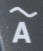
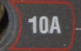

(magnetic-force-mu0-overall)=
# Magnetic Force & the Determination of $\mu_0$


## Background

```{danger}
⚠️ ⚠️ ⚠️ ⚠️ WARNING ⚠️ ⚠️ ⚠️ ⚠️

⚠️ ⚠️ ⚠️ ⚠️ HIGH CURRENT IN USE TODAY ⚠️ ⚠️ ⚠️ ⚠️

⚠️ ⚠️ ⚠️ ⚠️ DO NOT TOUCH THE METAL CONDUCTORS (BARS) ⚠️ ⚠️ ⚠️

⚠️ ⚠️ ⚠️ ⚠️ YOU CAN BE SERIOUSLY INJURED ⚠️ ⚠️ ⚠️ ⚠️

⚠️ ⚠️ ⚠️ ⚠️ WARNING ⚠️ ⚠️ ⚠️ ⚠️
```


### ● Background Overview

```{admonition} OVERALL GOALS
:class: note
Use a set of parallel bars to generate magnetic fields to:
- Investigate the relationship between magnetic force $F_B$ and current $I$ (i.e. $F_B$ vs. $I$).
- Experimentally determine the permeability of free space $\mu_0$
- Along with your previous measurement of $\varepsilon_0$, determine the speed of light $c$
```


By measuring the magnetic force between two parallel current-carrying conductors, the permeability of free space, $\mu_0$, will be experimentally determined. $\mu_0$ is a fundamental constant of nature, and, with its electric equivalent $\varepsilon_0$ that we determined in an earlier experiment, we will now be able to determine the magnitude of the velocity of propagation of an electromagnetic wave --- the speed of light. These constants are related to the speed of light, c, by the following relation, derived from Maxwell's equations which describe the behavior of electric and magnetic fields:

```{math}
:label: eq-speed-of-light
c=\sqrt{\frac{1}{\varepsilon_0\mu_0}}
```

You will measure $\mu_0$ here, and with your previous measurement of $\varepsilon_0$, determine the speed of light $c$.

The 2019 redefinition of SI units defined exact values of fundamental constants including the electron charge $e$, the speed of light $c$, and Planck's constant $h$. The second is defined in terms of the frequency of a Cesium atomic clock. As a result, the value of $\mu_0$, the magnetic constant, must now be experimentally determined.

Note: Until 2019, $\mu_0$ was defined to be exactly $4\pi \times 10^{-7}$ T⋅m/A. This 2019 value is so close to the current best measurement, that you can use $\mu_0=4\pi \times 10^{-7}$ T⋅m/A as the *accepted value*. 


The magnetic field strength $B$ a distance $r$ from the center of a very long, straight conductor carrying a current $I$ is given by:

```{math}
:label: eq-magnetic-field
B=\frac{\mu_0 I}{2\pi r}
```

A conductor of length $L$ [m] carrying a current $I$ [A] in a magnetic field of strength $B$ [T] experiences a force $F_B$ [N], given by:

```{math}
:label: eq-magnetic-force
\vec{F_B}=I \vec{L} \times \vec{B} =I L B \sin{\theta}
```

where $\theta$ is the angle between the vectors $\vec{B}$ and $\vec{L}$. If the magnetic field is produced by the current in a second conductor, the currents in the two conductors exert equal magnitude and opposite forces on each other.

For the case of two long, parallel conductors, each carrying the same current $I$ and separated, center-to-center, by the distance $d_\text{center-to-center}$, the force between the two conductors is the force on one in the magnetic field of the second. Thus if {eq}`eq-magnetic-field` is used in {eq}`eq-magnetic-force`, we obtain for the force:

```{math}
:label: eq-parallel-conductor-force
\boxed{
F_B=\frac{\mu_0}{2\pi}\frac{L I^{2}}{d_\text{center-to-center}}
}
```

By measuring the force between two such conductors, the value of $\mu_0$ can be determined. By considering the parameters of the apparatus to be used, it can be seen that the magnitude of the force between the two conductors is quite small and will require some care to accurately measure. If $L$ is about 30 cm, $I$ about 10 A, and $d_\text{center-to-center}$ about 2 mm, the force would be in the range of $10^{-4}$ N, or the weight of a few milligrams of mass. Since this force is well below the weight of a reasonable conductor to be used for the experiment, a counter weighted balance system will be used to provide the mechanical support for the movable conductor. This is essentially the same apparatus as {ref}`Electric Force & the Determination of ε₀ <electric-force-and-epsilon-overall>`. The movable conductor can then be loaded by a known mass whose weight can then be matched by the small magnetic force. The apparatus is schematically illustrated from a top-down perspective in {numref}`fig-apparatus-diagram`.

```{figure} Mu0Figures/Figure01.jpg
:name: fig-apparatus-diagram
:width: 100%
:align: center

Apparatus dimensions from a top-down perspective, similar to the apparatus setup from {ref}`Electric Force & the Determination of ε₀ <electric-force-and-epsilon-overall>`.
```

As before, similar to the setup and measurement methods from the {ref}`Electric Force & ε₀ Lab <electric-force-and-epsilon-overall>`, an optical lever, telescope and scale are used to observe the deflection of the balance, which carries the movable, upper conductor. The magnitude of the magnetic force can be measured when the magnetic force has restored the loaded system to its original position. In this case we make the same magnitude current flow in opposite directions in the two conductors so the force between the two conductors is repulsive. Thus on the upper conductor, there is a gravitational force down (the weight of the added mass) and a magnetic force upward which we will adjust by controlling the current equal to the gravitational force. More conveniently than the electric force version of the balance beam, this equilibrium is stable!

With the required balancing current determined along with the other dimensions of the apparatus, we can now determine the value of $\mu_0$.


### ● Equipment

<!---
- Telescope with crosshair & centimeter-scale ruler on vertical pole
- AC power from wall outlet, controlled with large, cylindrical potentiometer. Controls range from 0 -- 100% of wall power (~0 -- 15 A). Ignore the scale on the dial since the knob is not actually lined up to them.
- Voltage transformer to drop AC voltage to ~6 V (small metal cube)
- Fluke multimeter -- in series, set to read AC current ($\tilde{\text{A}}$), red wire to 10 A, black wire to COM ports
- Small masses of 1 -- 500 mg, plastic tweezers
- Parallel-conductor apparatus
  - Bottom conductor held in static position
  - Top conductor that can swing up or down when changing amount of applied mass or current. Set up to be parallel to bottom conductor when empty (holding 0 mg).
  - Mirror to view the scale (ruler) via telescope to determine angle between plates
  - Beam lift knobs to reset top plate position
  - Leveling screws to level whole apparatus
- x4 Banana plug wires (12 AWG, x2 1', x2 3') connecting wall power from transformer to ammeter & parallel-conductor apparatus
- Protective box with the mirror-to-scale distance written on it

--->

```{table} Equipment
:name: parallel-conductor-equipment-table

| Category | Items |
|---|---|
| **Optical Measurement** | • Telescope with crosshair<br>• Centimeter-scale ruler mounted on vertical pole |
| **Power Supply** | • AC power from wall outlet controlled by large cylindrical potentiometer (0–100% of wall power, ~0–15 A) *Dial markings are not accurate; ignore scale on knob* <br>• Voltage transformer (small metal cube) reducing AC voltage to ~6 V |
| **Current Measurement** | • Fluke multimeter used as AC ammeter ($\tilde{\text{A}}$, ), connected **in series** with circuit<br>• One lead in **10 A** port , other lead to **COM** port  |
| **Masses & Tools** | • Small masses (5, 20, 50, 100, 200 mg)<br>• Plastic tweezers for handling masses |
| **Parallel-Conductor Apparatus** | • Bottom conductor fixed in place<br>• Top conductor free to swing vertically when current or mass changes<br>• Adjust so conductors are parallel when **0 mg** is applied<br>• Mirror used with telescope to read ruler and determine balance beam angle<br>• Beam lift knobs to reset top conductor position<br>• Leveling screws to level apparatus |
| **Electrical Connections** | • 4× banana plug wires (12 AWG)<br> • 2× 1 ft<br> • 2× 3 ft<br>• Connect transformer $\rightarrow$ ammeter $\rightarrow$ parallel-conductor apparatus |
| **Additional Equipment** | • Protective box with mirror-to-scale distance written on it |
```


### ● Adjustment of apparatus

The apparatus has been carefully adjusted before your lab and should not require further significant adjustments. This section describes how the apparatus was prepared. If something seems to need adjusting, see the lab instructor. The apparatus is very similar to the apparatus setup from E-1.

1. The beam lift provides a definite location for the beam and thus guarantees continued alignment of the parallel conductors. Use the beam lift each time you change weights or relocate the counterweight.
2. The fixed conductor can be adjusted vertically, the movable conductor horizontally, so that the conductors are parallel. *If the conductors are NOT parallel with no mass in place, seek the instructor's help.*
3. The counterweight behind the mirror can be used to change the equilibrium separation of the conductors.
4. Level the apparatus with the adjusting screws so that it sits securely on the table.
5. Mirror-to-scale distance was measured from rear of mirror (reflective surface) to roughly the middle of $S_1$ and $S_0$ on the scale (ruler).


## Experimental Procedure

### ● PRECAUTIONS

```{danger}
**DO NOT TOUCH THE METAL CONDUCTORS (BARS)**
```

1. The wire frame that supports the current carrying conductor and counterweight is supported on knife edges. The frame is easily bent, and the knife edges can be easily damaged. Treat the system with the same care as a precise analytical balance. Handle the weights with tweezers and store them in the case.
2. The current must pass through the knife edges and intense local heating is produced. Reduce the current to zero as soon as possible after making the observations.
3. **Do not be the ground of the circuit (don't go touching bare wires).**
4. **The current should not exceed 15 A!**


## Experimental Procedure
### ● Procedure Preview

<!---
```{admonition} OVERVIEW
:class: note
- Understand the relationship between magnetic force and current using a consistent induced magnetic field, reasonably produced by high current through parallel, cylindrical conductors
- Conduct three rounds of nine trials each (total 27 trials) of applying more mass (more gravitational force) and more current to produce a magnetic field (and therefore more magnetic force). Do the rounds sequentially rather than all of a single applied mass in a row to ensure you catch and correct any significant errors early (e.g. if the apparatus is bumped out of alignment) rather than having to do all 27 trials again. The order of the trials for applied masses would be 0, 25, 50, 75, 100, 125, 150, 175, 200, 0, 25, 50, 75, 100, 125, 150, 175, 200, 0, 25, 50, 75, 100, 125, 150, 175, 200 mg
- In this experiment, first determine the separation distance, $d$. Then add mass with a series of increasing masses and apply the necessary current $I$ applied along the conductors so they return to parallel where the separation distance returns to $d$. Under this condition, the magnetic force required to maintain the separation $d$ will be the difference of the gravitational force on the applied mass. Then determine $\mu_0$ for each trial, and an overall value through both averaging of all your trials and plotting of all your data (i.e. magnetic force vs. current² between the conductors). Comparing then your results from both analysis methods to the accepted $\mu_{0\text{-accepted}}$. Ultimately determine the speed of light $c$.
```
--->

```{admonition} OVERVIEW
:class: note
- Investigate the relationship between magnetic force and current using the magnetic field induced by high current in parallel, cylindrical conductors.
- Perform **three rounds of nine trials** each (27 trials total). In each round, sequentially apply less mass (below). Repeat this sequence three times (rather than completing all trials for a single mass) so that any alignment issues or experimental errors can be detected and corrected early without repeating the entire experiment.
    > 200, 175, 150, 125, 100, 75, 50, 25, 0 mg  
  - First determine the conductor separation distance, $d_\text{center-to-center}$. Then add mass and adjust the current $I$ until the conductors return to parallel, restoring the separation to $d_\text{center-to-center}$ (or telescope crosshair to $S_0$). Under this condition, the magnetic force balances the additional gravitational force from the applied mass.
  - For each trial, determine $\mu_0$. Obtain an overall value by both:
    - averaging the results from all trials, and  
    - plotting magnetic force vs. $I^2$.
  - Compare these results with the accepted value $\mu_{0\text{-accepted}}$, and use your measured value of $\mu_0$ to determine the speed of light $c$.
```

### ● Preliminary Setup

If $b$ is the mirror-to-scale distance and $a$ is the length of the frame (see {numref}`Figure {number} <fig-apparatus-diagram>`), then a straightforward geometrical analysis (like in Lab E-1) will show that the vertical displacement of the conductor, $y$, is given by:

```{math}
:label: eq-vertical-displacement
y=\frac{D a}{2 b}
```

where $D$ is the change in scale reading from the equilibrium value and the value when the two conductors are in contact (the contact reading is determined by adding a mass to the pan which depresses the beam until contact occurs). The factor of 2 results from the fact that the optical path reflected off of the mirror to the scale rotates through an angle twice that of the beam holding the movable conductor.

However, the change in scale reading doesn't account for the conductors' thickness. Since the B-field generated by current flowing in the cylindrical conductors is organized about their center, we must add in two radii to get the center-center separation between the two conductors. This gives us:

```{math}
:label: eq-center-separation
\boxed{
d_\text{center-to-center}=\frac{D a}{2 b}+2r_\text{conductor}
}
```

where $r_\text{conductor}=1.6$ mm is the radius of the conductor (multiplied by two to deal with the fact that we're dealing with two conductors).

1. Investigate the use of the telescope and scale so that the rotation of the frame can be measured in terms of scale divisions (see {numref}`fig-measurement-apparatus`).

```{figure} Mu0Figures/E6_Figure02_v02.jpg
:name: fig-measurement-apparatus
:alt: Schematic of the measuring apparatus, similar to the setup and measurement methods from E-1.
:width: 100%
:align: center

Schematic of the measuring apparatus, similar to the setup and measurement methods from E-1.
```

2. **Do not turn on the power supply until requested in the procedure below.**

3. In order to measure the equilibrium separation distance, $d_\text{center-to-center}$, of the conductors, two readings are made. The first is the scale reading, $S_0$, at the equilibrium position, i.e. when no mass has been added to the pan on the movable conductor.

4. The second scale reading, $S_1$, is made when the top conductor contacts the lower conductor. Place a sufficient mass in the pan on the top conductor to make it contact the lower, stationary conductor. Record $S_1$.

5. Determine $D = | S_1 - S_0 |$ from two scale readings (reminders: absolute value there is to represent the total distance between $S_0$ and $S_1$. If your crosshair crosses 0, make sure to consider the negative).

6. Create a common data table with $S_0$, $S_1$, $D$, $d_\text{center-to-center}$, length of frame $a=0.215$ m, mirror-to-scale distance $b$, wire length $L = 0.265$ m, and the wire radius $r_\text{conductor}=1.6$ mm. Also add in the graphically-determined $\varepsilon_0$ for each member of your lab group.

7. Calculate and record the conductor separation distance, $d_\text{center-to-center}$. Refer to {numref}`fig-apparatus-diagram`, {numref}`fig-measurement-apparatus`, {eq}`eq-center-separation`.


### ● Data Acquisition

8. Create a data table with columns for the variables below. You'll have rows for each trial as well as for averages. Reminder, you will conduct 27 trials total by conducting **three rounds** of *sequentially changing* the masses:
    > 200, 175, 150, 125, 100, 75, 50, 25, 0 mg  


      - Trial number
      - Lab member's initials (person looking through telescope)
      - $m_{\text{applied}}$: Applied mass
      - $F_{\text{G,applied}}=m_{\text{applied}} g$: Applied gravitational force
      - $F_B$: Applied magnetic force (to be calculated later)
      - $I_\text{min}$: Minimum current $I$ required to return to the equilibrium position
      - $I_\text{max}$: Maximum current $I$ required to return to the equilibrium position
      - $I$: Current $I$ required to return to the equilibrium position
      - $\delta I$: Estimated current uncertainty ***(to be assumed as majority source of uncertainty for today)***
      - $I^2$: Current squared
      - $\delta I^2$: Current squared
      - $\mu_{0\text{,experimental}}$: Experimental value of $\mu_0$
      - $\mu_{0\text{,experimental,maximized}}$: Maximized experimental value based on $\delta I^2$
      - $\delta\,\mu_{0\text{,experimental}}$: Uncertainty in experimental value
      - $\Delta\,\mu_{0\text{,experimental}} - \mu_{0\text{,accepted}}$: Magntitude of difference between experimental and accepted values of $\mu_0$


9. With the power off, make sure the conductor beam is at equilibrium, then place the specified mass on the upper conductor.

10. **Make sure the transformer setting is zero before turning on the power.** While observing the scale through the telescope, slowly increase the current until the scale returns to the equilibrium point $S_0$. This is the current required to 'balance' the weight of the added mass. **As soon as you make this reading, reduce the transformer setting to zero and turn off the power switch. Under no circumstances should the current exceed 15 A.**

11. **DO NOT LEAVE THE POWER ON, IT CAN BURN OUT THE WIRES IF LEFT ON TOO LONG AND CAUSE INJURY**

12. Record your values for the current trial and calculate $\mu_0$ from {eq}`eq-parallel-conductor-force`.

13. With power off, replace the applied mass with the next trial, and repeat the previous steps to find the current required to balance the system again.

14. After completing all 27 trials, and ignoring the trials that give a divide-by-zero error, calculate your experimental average and uncertainty range based on $\delta I^2$.

15. If, after performing the graphical data analysis below, you find some or all of the data unacceptable, repeat from step 3, checking that the telescope and scale were not disturbed during your measurements.

### ● Analysis of data

1. The graphical display of data permits the comparison of all the values and associated errors at once. Points that depart markedly from the general trend of the data are quickly detected. We expect from theory (from {eq}`eq-parallel-conductor-force`) that:

   ```{math}
   :label: eq-force-current-squared
   F_B=k I^{2}
   ```

   **Using all your data points**, *scatter plot* $F_B$ as ordinate ($y$) and $I^{2}$ as abscissa ($x$). Fit a straight line through the points and determine the slope of the curve, $k$. Reordering {eq}`eq-parallel-conductor-force`, the value of $k$ is given by:

   ```{math}
   :label: eq-slope-constant
   k=\frac{\mu_0}{2\pi}\frac{L }{d}
   ```

   $\mu_0$ can now be determined by rearranging {eq}`eq-slope-constant` and using this experimentally determined value $k$. Thus:

   ```{math}
   :label: eq-mu0-from-slope
   \mu_0=\frac{2\pi k d}{L}
   ```

2. Using your experimentally-determined values of $\varepsilon_0$ you determined in Experiment E-1 and the value of $\mu_0$ determined above, calculate your estimate for the speed of light $c$ with {eq}`eq-speed-of-light`. You can estimate your uncertainty in $c$ by varying $\mu_0$ and $\varepsilon_0$ by their own uncertainty ranges to see how much $c$ varies.


## Post-Lab Submission --- Interpretation of Results

### ● Finalized Spreadsheets

  - Make sure to submit your finalized data table (Excel sheet).
  - Please include concise summary table.
  - Please include plots:
    - $F_B$ vs $I^2$
    - $F_B$ vs $I$ (for qualitative comparisons)


### ● Post-lab Writeup

- In a **paragraph**, summarize your error analysis. Be qualitative, not only quantitative.
  - What is the precision of your equipment?
  - What are possible sources of systematic (i.e. affecting accuracy) and random (i.e. affecting variance) errors?
  - What are your measured uncertainties, and, based on these uncertainties, how do your final results for $\mu_0$ change? I.e. do your different measurement and slope uncertainties make your final results larger or smaller?
  - The following variables are ones you had control over for today's lab. Individually increase each by 1% in your Excel sheet. How do these changes affect your final $\mu_0$ values; which has the greatest affect? If results are larger or smaller, are they more or less accurate to expected values?
    - Mass
    - Current
    - $d_\text{center-to-center}$
  - Based on your uncertainties (i.e. $\delta \varepsilon_0$ and $\delta \mu_0$), how do they affect you experimental value for speed of light $c$? (i.e. larger/smaller?)


- In a **paragraph**, summarize the results you have determined for all cases. Consider:
  - What was the point of today's lab; what did we aim to discover?
  - Compare your experimental values of $\mu_0$ from plotting with {eq}`eq-mu0-from-slope` and the $\overline{\mu_0} \pm \delta \mu_0$ of your values from {eq}`eq-parallel-conductor-force`.
    - Do they agree with each other?
    - Do they agree with the accepted value of $\mu_0 = 1.2566\times 10^{-6}$ T⋅m/A?
  - Explain physically, why would you expect the linear fit to go through the origin?
  - Do your experimental results agree with the speed of light ($c = 2.9979\times10^8$ m/s)?
  - Given the following as unchanging: the phyiscal dimensions of our apparatus setups for this lab and the $\varepsilon_0$ lab, their respective currents and voltages for a individual trial:
    - If you were to find the speed of light $c$ to be ***larger*** than the accepted value above, what would it imply about electric and magnetic fields/forces?


## Post-Lab Submission --- Interpretation of Results


- Paragraph of your results ± uncertainties from your data. Make sure to include discussion of the following:


## The Whiteboard

```{figure} Mu0Figures/mu0_2025_Summer_01_v01.jpg
:name: mu0_whiteboard_01
:width: 100%
:align: center

Overview. `LINEST()` function.
```

```{figure} Mu0Figures/mu0_2025_Spring_02_v02.jpg
:name: mu0_whiteboard_02
:width: 80%
:align: center

Separation distance equation; multimeter settings.
```

```{figure} Mu0Figures/mu0_2025_Summer_03_v02.jpg
:name: mu0_whiteboard_03
:width: 100%
:align: center

Plot notes; Speed of Light calculations.
```